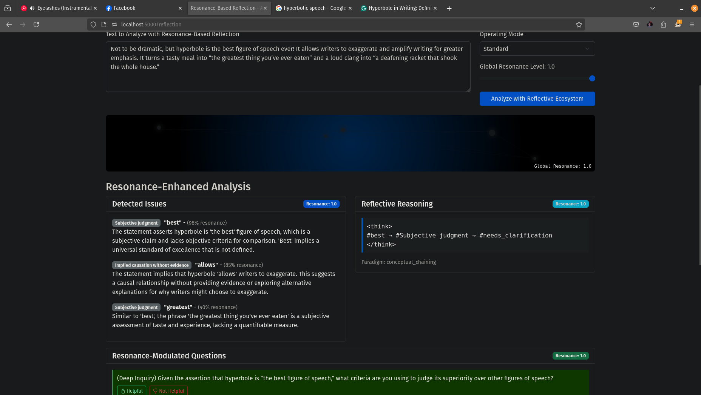

# AI-Socratic-Clarifier

A tool for analyzing statements through a Socratic lens, detecting logical issues, and generating thoughtful questions to promote clearer thinking.

## Overview

The AI-Socratic-Clarifier analyzes text using AI models to identify potential issues like:
- Absolute statements
- Vague or imprecise language
- Unsupported claims
- Subjective judgments
- Implied causation without evidence

For detected issues, it generates thoughtful Socratic questions to help clarify thinking and improve reasoning.

## Features

- **Multiple Analysis Modes**: Standard analysis, deep inquiry, and reflective ecosystem
- **Interactive Web Interface**: Easy-to-use chat and analysis UI
- **Resonance-Based Reflection**: Advanced analysis with conceptual chaining paradigms
- **Feedback System**: Improve the system by providing feedback on questions
- **Direct Ollama Integration**: Works with local AI models through Ollama



## Getting Started

 Sorry the repo is a mess, haven't tried to install from scratch and will be trying to clean it all up soon.

### Prerequisites

- Python 3.8 or higher
- [Ollama](https://ollama.ai/) installed and running
- An LLM model like gemma3, llama3, etc. available through Ollama or LM Studio (see [config](https://github.com/angrysky56/ai-socratic-clarifier/blob/main/config.example.json))

### Installation

1. Clone the repository:
   ```bash
   git clone https://github.com/angrysky56/ai-socratic-clarifier.git
   cd ai-socratic-clarifier
   ```

2. Create and activate a virtual environment:
   ```bash
   python -m venv venv
   source venv/bin/activate  # On Windows: venv\Scripts\activate
   ```

3. Install dependencies:
   ```bash
   pip install -r requirements.txt
   ```

### Usage

Start the application with the simplified start script:

```bash
./start_socratic.py
```

Then access the web interface at:
- **Main Interface**: http://localhost:5000/
- **Chat Interface**: http://localhost:5000/chat
- **Reflection Interface**: http://localhost:5000/reflection

## Web Interface

### Analysis Page
Enter text for analysis and view detected issues with corresponding Socratic questions.

### Chat Interface
Have a conversation where the system analyzes your statements and responds with Socratic questions to promote deeper thinking.

### Reflection Interface
Use the advanced reflective ecosystem for deeper analysis with conceptual chaining and expert lexicons.

## Configuration

Configuration settings are stored in `config.json` and can be modified to:
- Change the local model
- Adjust analysis parameters
- Configure embedding models
- Enable/disable specific features

## Customization (currently removed feature as unneeded may re-integrate a version of this)

You can customize issue detection by adding patterns to the `custom_patterns` directory:
- `vague.json`: Patterns for vague terminology
- `gender_bias.json`: Patterns for gender bias
- `stereotype.json`: Patterns for stereotypical language
- `non_inclusive.json`: Patterns for non-inclusive language

## Troubleshooting

If you encounter issues:

1. Ensure Ollama is running with `ollama serve` (or try LM Studio, but untested and may be missing in the startup script, will check later)
2. Verify the model in your config.json is available in Ollama
3. Check if your environment has all required dependencies installed
4. Review the console output for specific error messages

## Contributing

Contributions are welcome! Feel free to submit issues or pull requests.

## License

[MIT]
