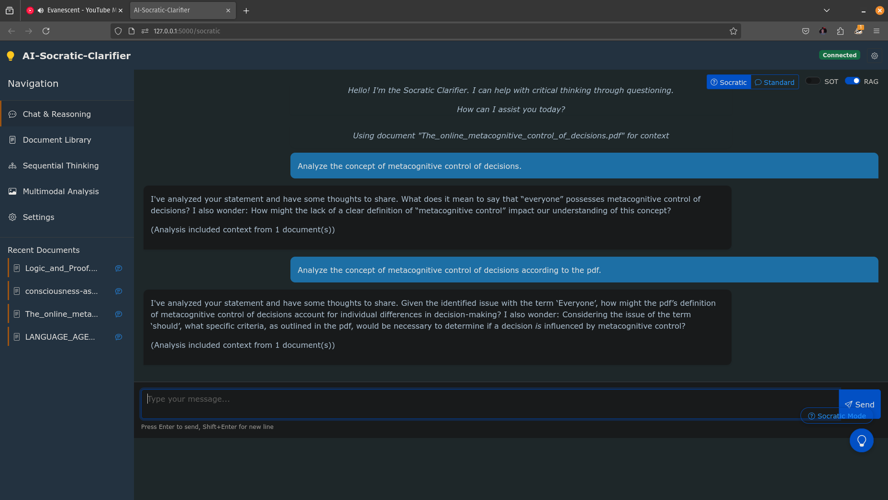

# AI-Socratic-Clarifier

An advanced system for enhancing critical thinking through AI-assisted questioning and reflection. The AI-Socratic-Clarifier analyzes text and generates Socratic questions that prompt deeper reflection and exploration of ideas.

Currently in development and not functioning properly due to me not being a coder.


## Key Features

- **Enhanced UI**: A consolidated single-window interface with document management and reflective visualization
- **Socratic Question Generation**: Analyze text and generate insightful questions to promote critical thinking
- **Symbiotic Reflective Ecosystem (SRE)**: Advanced reflective reasoning system for deeper analysis
- **Sketch of Thought [SoT](https://github.com/SimonAytes/SoT)**: Efficiently structured reasoning approach for complex problem-solving.
- **Document Management**: Upload, view, and use documents as context for AI analysis
- **Multimodal Support**: Process images and PDFs using OCR and multimodal AI models
- **RAG Context**: Use uploaded documents as retrieval-augmented generation context for more informed AI responses
- **Advanced RAG**: Enhanced document retrieval and processing with improved relevance scoring and large context utilization

## Getting Started

### Prerequisites

- Python 3.8 or higher
- Ollama (for local LLM integration)
- Tesseract OCR (for document processing, optional)

### Installation

1. Clone the repository:
   ```bash
   git clone https://github.com/angrysky56/ai-socratic-clarifier.git
   cd ai-socratic-clarifier
   ```

2. Install dependencies:
   ```bash
   # Create a venv
   python -m venv venv
   source venv/bin/activate # On Windows, use 'venv\Scripts\activate'
   # Install dependencies
   pip install -r requirements.txt
   python install_all_dependencies.py

   ```

3. Configure Ollama models:
   
   Ensure Ollama is running and the required models are available:
   ```bash
   ollama pull gemma3:latest    # Default model for text analysis
   ollama pull llava:latest     # Multimodal model for image processing (optional)
   ```

   Copy the configuration file:
   ```bash
   cp config.example.py config.py
   ```
   Edit `config.py` to set the model and other configurations if desired.

4. Start the application:
   ```bash
   python start_ui.py
   ```

5. Open your browser and navigate to:
   ```
   http://localhost:5000
   ```


## Configuration

Configuration options are available in `config.json`:

```json
{
    "integrations": {
        "lm_studio": {
            "enabled": true,
            "base_url": "http://localhost:1234/v1",
            "api_key": null,
            "default_model": "default",
            "timeout": 60
        },
        "ollama": {
            "enabled": true,
            "base_url": "http://localhost:11434/api",
            "api_key": null,
            "default_model": "gemma3:latest",
            "default_embedding_model": "nomic-embed-text",
            "timeout": 60,
            "context_length": 8192,
            "multimodal_model": "llava:latest"
        }
    },
    "settings": {
        "prefer_provider": "auto",
        "use_llm_questions": true,
        "use_llm_reasoning": true,
        "use_sot": true,
        "use_multimodal": true,
        "sre_global_resonance": 0.8,
        "sre_adaptive_flexibility": 0.5,
        "use_sre_visualization": true,
        "auto_expand_sre": true,
        "sot": {
            "default_paradigm": "auto"
        },
        "use_document_rag": true,
        "advanced_rag": true,
        "rag_context_limit": 50000,
        "use_model_for_rag": true,
        "socratic_reasoning": {
            "enabled": true,
            "system_prompt": "You are a master of Socratic questioning who helps people improve their critical thinking. Your purpose is to craft precise, thoughtful questions that identify potential issues in people's statements. Based on the text and specific issues detected, create thought-provoking questions that will: 1) Encourage the person to recognize their own assumptions, 2) Help them examine whether generalizations account for exceptions, 3) Prompt consideration of evidence for claims made, 4) Lead them to clarify vague or imprecise language, 5) Guide reflection on normative statements that impose values. Make each question genuinely useful for deepening understanding, not rhetorical. Each question should directly address a specific issue identified in the text.",
            "reasoning_depth": "deep"
        }
    }
}
```

## Advanced Features

### Advanced RAG Integration

The system includes enhanced Retrieval-Augmented Generation (RAG) capabilities:

- Uses the full context window of large language models (up to 128k tokens)
- Improved document retrieval with advanced relevance scoring
- Better multimodal document processing
- Smarter context integration in prompts

To enable these features:

```bash
./apply_advanced_rag_fixes.sh
```

See `ADVANCED_RAG_README.md` for detailed information.

## Troubleshooting

If you encounter issues:

1. Run the UI fix script:
   ```bash
   python fix_all_ui.py
   ```

2. Check the logs for error messages

3. Ensure Ollama is running and the required models are installed

4. Verify that Tesseract OCR is installed for document processing

5. See the `UI_FIXES_README.md` for specific fixes and solutions

## License

This project is licensed under the MIT License - see the LICENSE file for details.

## Acknowledgments

- Inspired by the Socratic method of questioning
- Built with Flask, React, and Ollama
- Utilizes state-of-the-art language models for reasoning and analysis
